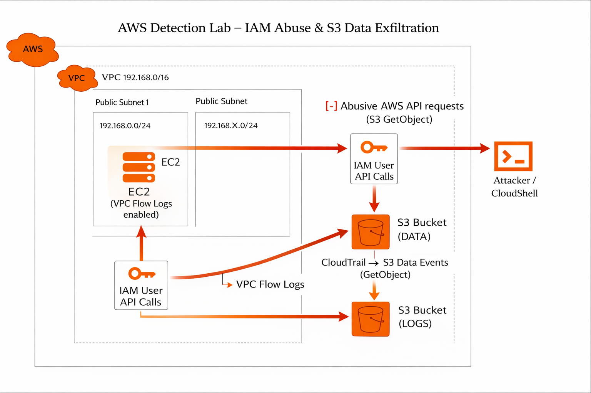

# Cloud Detection Lab

## Objective
This project builds a realistic AWS environment to **simulate real-world cloud attack scenarios**
The focus is on **visibility, logging, and detection engineering**, not exploitation.

The lab demonstrates hands-on skills aligned with **Cloud Security Engineer** and **Detection Engineer** roles, particularly for environments where cloud security and monitoring are critical.

---

## What This Project Demonstrates
- Cloud security architecture design
- Understanding of attacker behavior in AWS environments
- Log-based detection using native AWS telemetry
- Mapping detections to the MITRE ATT&CK framework
- Clear technical reasoning and documentation

---

## High-Level Architecture
The lab is deployed in a dedicated AWS account (region: `eu-west-1`) and includes:

- A custom VPC with public and private subnets
- Public and private EC2 instances to simulate exposed and internal assets
- S3 buckets representing sensitive data and centralized log storage
- Native AWS logging and detection services

The architecture is intentionally simple but realistic, mirroring common enterprise cloud setups.

---

## Threat Scenarios Simulated
This lab focused on **high-probability, real-world cloud attacks**:
1. **IAM Credential Abuse**
	- Compromised IAM user credentials used via AWS CLI
	- Enumeration and unauthorized data access
	
2. **EC2 Compromise**
	- Initial access to a public-facing EC2 instance
	- Suspicious outbound communication and internal movement

3. **S3 Data Exfiltration**
	- Large-scale or abnormal object downloads from a sensitive S3 bucket
	- Access from unusual IPs or time windows

Each scenario is mapped to **MITRE ATT&CK tactics and techniques** to align detections with industry standards.

---

## Logging & Visibility
The following AWS log sources are used as the foundation for detection:
- **CloudTrail**
	- AWS API activity
	- IAM actions, enumeration, and configuration changes

- **VPC Flow Logs**
	- Network-level visibility
	- Detection of scanning and abnormal traffic patterns

- **S3 Access Logs**
	- Object-level access tracking
	- Detection of potential data exfiltration

- **GuardDuty**
	- Used as a baseline and comparison against custom detections

The project emphasizes understanding **what each log source can and cannot detect**.

---

## Detection Philosophy
Detections are designed with the following principles:
- Behavior-based rather than signature-based
- Low false-positive rate
- Clear linkage between attack behavior and telemetry
- Explicit mapping to MITRE ATT&CK

Where applicable, detections are expressed in a portable way - Sigma 

---

## Repository Structure

cloud-detection-lab/  
│  
├── README.md  
├── architecture/  
│ └── architecture.md  
├── threats/  
│ └── threat-scenarios.md  
├── logging/  
│ └── logging-sources.md  
├── detections/  
│ ├── detection-overview.md  
│ ├── cloudtrail-detections.md  
│ ├── vpc-flow-detections.md  
│ └── s3-detections.md  
├── sigma/  
│ └── sigma-overview.md  
└── lessons-learned.md

---

## Project Timeline
- **Weeks 1–2**: Architecture design, threat modeling, documentation
- **Weeks 3–6**: AWS implementation and logging configuration
- **Weeks 7–10**: Attack simulation and log analysis
- **Weeks 11–12**: Detection development, Sigma rules, final documentation

---

## Key Takeaway
This project is designed to show not just *what* was built, but **why decisions were made**, how attacks are detected, and how cloud security works in practice.

If you can explain this lab end-to-end, you are already operating beyond entry-level cloud security.
